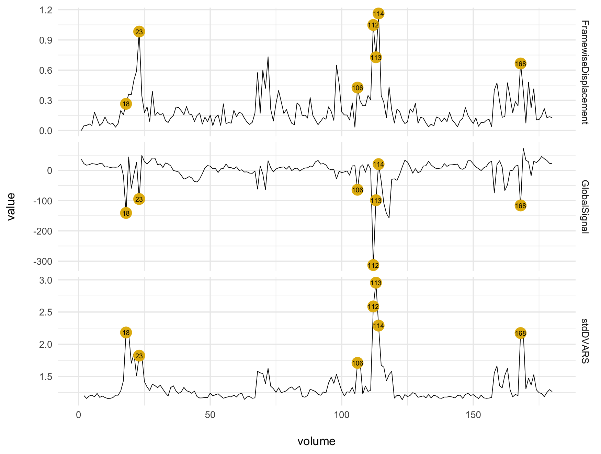

# auto-motion-fmriprep
Scripts for the automated assessment of motion artifacts in fMRI data using fmriprep confounds.

**Please note that this project is still in development and has not yet been validated with data outside of the [Developmental Social Neuroscience Lab](https://github.com/dsnlab) at the University of Oregon. If you are interested in using this tool, please proceed with caution.**

**If you use `fmriprep` and would like to contiribute to this project by sharing your `confounds.tsv` files (and potentially hand coded visual artifacts), please email me!**

## About
These scripts use machine learning and the motion indicators from [fmriprep](https://github.com/poldracklab/fmriprep) to detect motion artifacts in fMRI data and returns a "trash" regressor (i.e. a series of 1s and 0s denoting the presence or absence of motion artifacts) that can be used in first level models along with other nuisance regressors. 

The machine learning classifier was developed to accurately classify visual motion artifacts (i.e. striping) using data from the [Developmental Social Neuroscience Lab](https://github.com/dsnlab) at the University of Oregon. This classifier can be applied to new data to predict motion artifacts using these scripts. For more information about the development and validation of the classifier, please check out my poster from [FLUX 2018](https://dcosme.github.io/posters/Cosme_FLUX_2018.pdf).

## Requirements
* fMRI data must be preprocessed using `fmriprep` and each sequence you want to model must have a `confounds.tsv` file
* [R](https://cran.r-project.org/) must be installed wherever you plan to run the scripts

## Usage
### 1. `config.R`
Modify this script to specify user-defined variables and paths.

### 2. `auto_motion_fmriprep.R`
This script loads the fmriprep confound files, applies the machine learning classifier to predict motion artifacts, and returns summaries by task, task and run, and trash volumes only. 

If `writeRP = TRUE`, it will also export a text file with realignment parameters (or realignment parameters converted into Euclidean distance) and the trash regressor for each participant/wave/task/run. 

If `writePlot = TRUE`, it will export timecourse plots with volumes predicted to have motion artifacts highlighted on confounds of your choice. Here is an example plot using framewise displacement, global signal, and standardized DVARS:

You can either run this script directly in R or RStudio, or submit it as a job on a computational grid. If you are using [slurm](https://slurm.schedmd.com/) for job scheduling, you can modify the `install_packages.bash` and `run_auto_motion.bash` scripts to run the code on a copmutational cluster.

## Acknowledgements
Thank you to [John C. Flournoy](https://github.com/jflournoy) and [Nandita Vijayakumar](https://github.com/nandivij) for their help developing this code. Huge thank you to Gracie Arnone, Oscar Bernat, Cameron Hansen, Leticia Hayes, & Nathalie Verhoeven for helping hand code motion artifacts.
